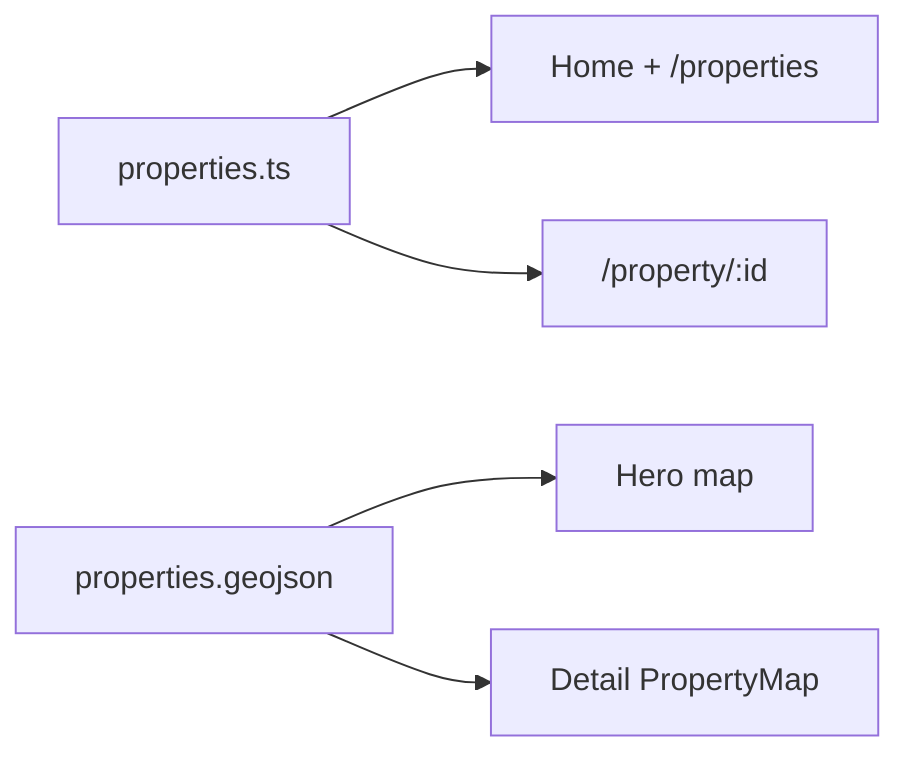

# Adding a new property — onsite guide

This guide matches how **Hillview House** (`hillview-house`, “house 13”) was added: data, images, map, SEO, detail-page behaviour, and local run. Use it as a template for the next home.

**Edit this file** when your team finds new steps (e.g. photo order, portrait rules, or map zoom).

---

## How the site picks up a property

- **Listings** (homepage “Our Collection” and `/properties`) read the `properties` array in [`client/src/lib/properties.ts`](../client/src/lib/properties.ts). Add one object → cards appear automatically.
- **Detail page** is `/property/<id>` where `<id>` is the `Property.id` slug (e.g. `hillview-house`).
- **Hero map markers** (homepage) and **single-property map** (detail) use [`client/public/data/properties.geojson`](../client/public/data/properties.geojson). Each point must use the **same `id`** as in `properties.ts`.
- **Production build** copies static assets from `client/public/` into `dist/public/` when you run `npm run build`. Do not hand-edit `dist/` for content.



---

## Checklist (do in order)

1. [ ] Choose **`id`** (kebab-case, permanent URL): e.g. `hillview-house`.
2. [ ] Create image folder: e.g. `client/public/images/houses/house 14/` (or a named folder like `parkviewhouse/` if you prefer).
3. [ ] Process rasters → **WebP**, long edge **≤ 1920px** (e.g. Sharp `fit: 'inside'`). Template: [`scripts/process-house-13-images.mjs`](../scripts/process-house-13-images.mjs) — copy and adjust paths, ordering, and output names.
4. [ ] Name files predictably, e.g. `house-14-exterior-1.webp`, `house-14-kitchen-1.webp`, … so ordering stays clear.
5. [ ] Build the **`images[]` array** in `properties.ts` as an **explicit list** of paths (avoid `Array.from` ranges once files are curated — removed files must not stay in the array).
6. [ ] Set **`thumbnail`** to the **card / map popup** image (often same as **`images[0]`** / hero lead).
7. [ ] Add **`Property`** object in `properties.ts` (all fields — see table below).
8. [ ] Geocode **Eircode** (or use a vetted point). Set **`location.lat` / `location.lng`**.
9. [ ] Add **GeoJSON `Feature`** to `properties.geojson`: **`coordinates`: `[lng, lat]`** (GeoJSON order), matching **`properties.id`**, **`thumb`** same path as `thumbnail` where possible.
10. [ ] Add **sitemap** URL in [`client/public/sitemap.xml`](../client/public/sitemap.xml): `https://theadarecollection.com/property/<id>`.
11. [ ] **Detail map** — In [`client/src/components/property-map.tsx`](../client/src/components/property-map.tsx), set **initial zoom** and **drive/walk radius** for off–Adare-Manor homes (see existing branches: `cragleigh-house`, `hillview-house`, `dunes-lodge`). Add a constant in [`client/src/lib/map-utils.ts`](../client/src/lib/map-utils.ts) if you need a new radius.
12. [ ] **Optional — Add-on Services row** — In [`client/src/pages/property-detail.tsx`](../client/src/pages/property-detail.tsx), add your `id` to the “Bespoke Hospitality & Entertainment” condition if it should match Hillview / Croagh / Parkview.
13. [ ] **Optional — Brochure / button width** — Same file: some `id`s hide brochure or change button layout; align with similar properties.
14. [ ] **Portrait photos** — **Automatic** on the detail carousel for most houses (see [Portrait vs landscape carousel](#portrait-vs-landscape-carousel)). Parkview/Croagh still use legacy path guesses for the first paint; no per-property portrait code needed for Hillview-style listings.
15. [ ] **Copy hygiene** — [Amenities vs Add-on Services](#amenities-vs-add-on-services); avoid duplicating chauffeur / chef / helicopter / laundry service / entertainment if those are covered by the icon grid.
16. [ ] **Badge** — Optional: [`getPropertyCollectionBadge`](../client/src/lib/properties.ts) (`DELUXE` vs default `EXECUTIVE`).
17. [ ] **Verify** — `npm run dev` (or `npm run build && npm run start`). Open `/`, `/properties`, `/property/<id>`, confirm hero marker, detail map, gallery, no 404 images.

---

## `Property` fields (`properties.ts`)

| Field | Purpose | Notes |
|--------|---------|--------|
| `id` | URL slug | Must match GeoJSON `properties.id`. |
| `name` | Display name | |
| `subtitle` | Line under title on detail | |
| `bedrooms` | Number for logic / SEO | Use `bedroomsLabel` for ranges like `"6-7"`. |
| `description` | Short card blurb | Homepage + listing cards. |
| `fullDescription` | Long body | Paragraphs separated by `\n\n` if you want breaks. |
| `price` | e.g. `"POA"` | |
| `images` | Ordered gallery | First item = hero + default OG image in SEO hook. |
| `thumbnail` | Card + map thumb | Often equals `images[0]`. |
| `features` | Bullet list | Left column on detail. |
| `amenities` | Bullet list | Right column; **don’t repeat** add-on grid items (see below). |
| `location` | `{ lat, lng }` | Match map point (WGS84). |
| `walkingDistance` | Location line | e.g. drive time to Adare Manor. |
| `eircode` | Optional | Shown on detail; structured data if set. |
| `videoUrl` | Optional | `/videos/...` |
| `matterportUrl` | Optional | 360° embed |

---

## Images & gallery

1. **WebP only** in the live `images` array for new work (older houses may still reference `.jpg`).
2. **Resize** so the image fits inside **1920×1920** (long edge capped); keeps weight reasonable.
3. **Order** — Typical story: lead **exterior** → **kitchen / living** → **sitting** → **bathrooms** → **bedrooms** → **attic / extra** → any **extra exteriors** at the end (as with Hillview). Your marketing order may differ; only the **array order** changes.
4. **After removing files** from disk, **remove** those paths from `images[]` immediately to avoid broken slides.
5. **Hero / thumbnail / SEO** — `images[0]` is used for Open Graph in the detail page hook; keep it as the intended **main** shot. **`thumbnail`** should match for cards and GeoJSON **`thumb`** for map popups.

**Reference paths (Hillview):**  
`/images/houses/house 13/house-13-exterior-4.webp`  
(URL-encode the space as `%20` in raw links.)

---

## Portrait vs landscape carousel

For **every** gallery image we read **intrinsic pixels** after load (`naturalHeight > naturalWidth × 1.02` → portrait).

In [`client/src/pages/property-detail.tsx`](../client/src/pages/property-detail.tsx):

- **`carouselImageOrient`** — Stored per image `src` for the **default** carousel branch (most properties, including **Hillview**).
- **Portrait** slides use centred **`object-contain`** (same treatment as Croagh’s portrait styling) so vertical shots aren’t aggressively cropped like **`object-cover`** landscape heroes.
- **Landscape** slides keep your existing **`object-cover`** rules (captions, offsets, Rolex/putters exceptions, etc.).

**Parkview** and **Croagh** still run first in the styling chain with their **path-based guesses** so the first paint is usually correct before `onLoad`; they also update **`carouselImageOrient`** for consistency.

**Older special cases** unchanged: **First Tee**, and the explicit **hall / bathroom / house-9** `object-contain` list still win before the automatic portrait branch.

You don’t need to list portrait filenames anywhere—only use correctly proportioned assets in `images[]`.

---

## Amenities vs Add-on Services

The detail page has a fixed **Add-on Services** grid (chauffeur, chef, helicopter, laundry, hospitality, etc.) for most homes.

- Put **what’s included in the stay** in **`amenities`** (WiFi, linens, **in-home** laundry machines, daily housekeeping, parking, EV, office, etc.).
- Put **booked / on-request services** that **duplicate** that grid **only** in the grid — not again as long amenity bullets (Hillview was trimmed for this reason).
- **Exception:** one-line “available on request” summaries are used on some older entries; prefer **not** duplicating the same services listed as icon cards.

---

## Map: GeoJSON + detail `PropertyMap`

**File:** [`client/public/data/properties.geojson`](../client/public/data/properties.geojson)

```json
{
  "type": "Feature",
  "geometry": { "type": "Point", "coordinates": [lng, lat] },
  "properties": {
    "id": "your-slug",
    "title": "Display name",
    "desc": "Short popup line",
    "beds": 6,
    "baths": 4,
    "price": "POA",
    "thumb": "/images/houses/.../hero.webp"
  }
}
```

Optional **`bedsLabel`** exists for popups (see other features).

**Detail page map** — [`property-map.tsx`](../client/src/components/property-map.tsx) chooses zoom and whether to draw a **walk** or **drive** circle. New off-site homes should follow the closest existing pattern (e.g. ~45 min drive → `hillview-house` + `FORTY_FIVE_MIN_DRIVE_RADIUS_METERS` in [`map-utils.ts`](../client/src/lib/map-utils.ts)).

---

## Local development

- **`npm run dev`** — Express + Vite; **`PORT=5000`** in [`package.json`](../package.json) → **http://localhost:5000**
- **`npm run build` then `npm start`** — Serves **`dist/public/`**; default port **5000** unless `PORT` is set.
- Property links on localhost use `window.location.origin` in [`map-utils.ts`](../client/src/lib/map-utils.ts) for marker URLs.

Only one of `dev` / `start` should bind **5000** at a time. If the port is busy (e.g. macOS AirPlay), use `PORT=5001 npm run dev`.

---

## Files quick reference

| Concern | File |
|--------|------|
| All property data & gallery order | `client/src/lib/properties.ts` |
| Homepage + detail map points | `client/public/data/properties.geojson` |
| Detail map zoom / radius | `client/src/components/property-map.tsx`, `client/src/lib/map-utils.ts` |
| Carousel (incl. portrait handling) | `client/src/pages/property-detail.tsx` |
| Sitemap | `client/public/sitemap.xml` |
| Image processing template | `scripts/process-house-13-images.mjs` |

---

## Reorder / refine after launch

- Change **only** the `images` array order in `properties.ts` (filenames can stay).
- If the **first slide** changes, update **`thumbnail`** and GeoJSON **`thumb`** if you want cards and map popups to match.
- Re-run **`npm run build`** before shipping static `dist/`.

---

## Eircode & geocoding

- Display in UI can keep spaces: `V35 HX25`.
- Geocoders often want **no space**: `V35HX25`.
- Use the same coordinates in **`Property.location`** and GeoJSON **`geometry.coordinates`**. A **townland / village centroid** is acceptable if the exact rooftop geocode is unknown.
